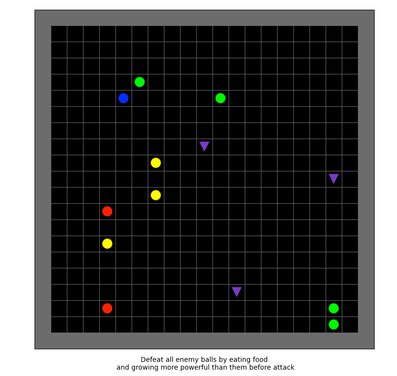
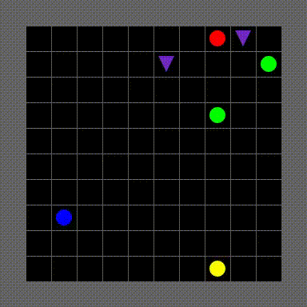

<div align = "center">

</div>

<div align="center">
<!-- Python -->

<!-- Release -->
    
<!-- Build Status -->
       
<!-- Development Status -->
     
<!-- Stability -->
    
</div>

<div align="center">
  <sub>Built with :heart: &nbsp; by 
    <a href = "https://samshowalter.github.io"> Sam Showalter</a>
  </sub>
</div> 
<br/>


# Contents
- [Overview](#overview)
- [Installation](#install)
- [Dependencies](#dependencies)
- [Usage](#usage)
- [Scripts](#scripts)
    + [Environment Development](#manual_control)
    + [Environment Benchmarking](#benchmark)
    + [Agent Training](#agent_training)
    + [Agent Rollouts](#agent_rollouts)
    + [Interestingness Analysis](#analyze_interestingness)
- [Cameleon Environments](#environments)
    + [Canniballs](#canniballs)
- [Artifacts](#artifacts)
- [Examples](#examples)
    + [DQN + Canniballs-Easy-12x12](#dqn_canniballs_easy)
- [Known Issues](#known_issues)
- [Usage and Debugging Tips](#tips)
- [Support](#support)


<a name = "overview"></a>
# Overview


> `CAMeLeon` is a simple, flexible interface to apply CAML/CARLI to and train agents on arbitrary RL environments

It's ultimate goals are as follows:
1. Provide a general grid-based interface upon which gridworld games of arbitrary complexity may be built.
2. Seamlessly integrate the general Cameleon environment interface with RLlib's distributed, high optimized training and rollout system 
3. Ensure that arbitrary model-free (and eventually, model-based) RL algorithms may be trained on Cameleon environments through a standard CLI / API.
4. Effectively rollout trained RL agents in environments while extensively collecting and storing their internal state through a standardized policy extractor
5. Automatically port Cameleon rollout information into CAML's **Interestingness-xdrl** and **Imago** competency assessment packages.

<a name = "install"></a>
# Installation

```
git clone https://gitlab.sri.com/caml/CAMeLeon.git
cd cameleon
pip install -e .[caml]
```

<a name = "dependencies"></a>
# Dependencies

**NOTE**: Current Cameleon requires a small edit of the Ray source code to work. This edit patches a known bug in RLlib and should be patched within two weeks of this writing (2021.07.29) with a nightly wheel and eventually a stable release.

**Python**:
- `Python >= 3.8.0`

**External**:
- `libhdf5-dev` -> `sudo apt-get install libhdf5-dev`

**Internal**:
- `logging`
- `argparse`
- `jupyter` (to examine notebooks)
- `matplotlib`
- `pillow`
- `pickle`
- `hickle` (pickle for HDF5)
- `tqdm`
- `numpy`
- `gym`
- `gym-minigrid`
- `ray[rllib]`
- `ray[default]`
- `ray[tune]`
- `tensorflow` 
- `pytorch`

<a name = "usage"></a>
# Usage

Cameleon is structured to allow for a user to completely define a scenario in which they would like to assess competency of an agent. Therefore, it includes functionality to assist in grid-world game development, benchmarking of created environments (speed, memory, etc.), agent training within an environment, and automated rollouts of a trained agent in the environment for later use in CAML assessments. Below are the scripts, in topological order, that a user would use to construct a Cameleon system.

<a name = "scripts"></a>
# Scripts

In all of the following bash scripts, reference to `$Variables` indicates a user-defined input parameter.

<a name = "manual_control"></a>
## Environment Development 

Building a grid-world environment is relatively straightforward and provides enough flexibility while remaining performant for fast RL training. To assist in this development, Cameleon provides a manual control API to run the environment manually and test its functionality. Relevant artifacts like rewards, observations, and actions can be viewed from the console as well to confirm the agent's interaction with the environment is correct. Once the environment is created, call it from the `env_name` parameter and specify the relevant `key_handler` between minigrid and cameleon. 

```bash
# Run the script
python -m cameleon.bin.manual_control \

  #  -> Required <-  #
  --env-name = ${str: Name of registered environment} \

  #  -> Optional <-  #
  --key-handler = ${str:  default = "cameleon": String denoted type of keyboard handler. Supports ['cameleon','minigrid']} \
  --seed        = ${int:  default = 42:         Random seed that governs game execution}  \
  --tile-size   = ${int:  default = 32:         Pixel size of each RGB tile.} \
  --verbose     = ${bool: default = True:       Option to see console output after each move (action, reward, step_num, etc.) \
```

<a name = "benchmark"></a>
## Environment Benchmarking

After the environment is built and debugged, it is important to verify that during training the environment can cycle at a high speed. This benchmarking script runs this test and several others, including how fast the environment can reset, how fast the encoded frames cycle, and how fast the rendered frames cycle. For the encoding cycle tests, add any relevant wrappers as a comma delimited string to ensure a realistic test.

```bash
# Run the script for env benchmarking
python -m cameleon.bin.benchmark \

  #  -> Required <-  #
  --env-name = ${str: Name of registered environment} \

  #  -> Optional <-  #
  --wrappers       = ${str:  default = 'encoding_only': Comma delimited string of wrappers to apply (see utils.env)} \
  --num-enc-frames = ${int:  default = 5000:            Number of encoded frames to cycle through in benchmark speed test} \
  --num-viz-frames = ${int:  default = 1000:            Number of visual frames to cycle through in ...} \
  --num-resets     = ${int:  default = 1000:            Number of resets to cycle through in ...} \
  --visual         = ${bool: default = False:           Whether or not to test visual frame speed. This is not applicable to RLlib training and is slow}
```

<a name = "agent_training"></a>
## Agent Training

Tapping into the RLlib training API, this script trains an RLlib agent with a few added arguments specific to the Cameleon environment. Specifically, the wrappers argument appropriately wraps the full-observability state to create a state of partial observability or an alternative representation altogether. Beyond some small setup and integration details, this represents the existing RLlib training API, documentation for which can be found [here](https://docs.ray.io/en/master/rllib-training.html).

```bash
# Run the script for training
python -m cameleon.bin.train \
  
  #  -> Required <-  #
  --env-name   = ${str: Name of registered environment} \
  --model-name = ${str: Name of RL algorithm supported by RLlib} \

  #  -> Hardware Reqs. <-  #
  --num-workers = ${int: default = 4: Number of CPU workers} \
  --num-gpus    = ${int: default = 1: Number of GPU workers} \

  #  -> Stopping Crit. <-  #
  --num-epochs    = ${int: default = 100: Number of training epochs} \
  --num-episodes  = ${int: default = 0:   Number of episodes to train for} \
  --num-timesteps = ${int: default = 0:   Number of timesteps to train for} \

  #  -> Misc. <-  #
  --wrappers          = ${str:  default = 'encoding_only': Comma delimited string of wrappers to apply (see utils.env)} \
  --checkpoint-path   = ${str:  default = None:            Model checkpoint filepath} \
  --checkpoint-epochs = ${int:  default = 10:              How often (in epochs) to make a model checkpoint} \
  --outdir            = ${str:  default = 'models/':       Root directory to store model checkpoints}\
  --framework         = ${str:  default = 'torch':         Model framework -> ('tf1', 'tf2', 'torch')} \
  --tune              = ${bool: default = False:           Whether or not to use Ray.tune} \
  --config            = ${JSON: default = "{}":            RLlib config} \
  --verbose           = ${bool: default = True:            Whether or not to show progress updates}
```


<a name = "agent_rollouts"></a>
## Agent Rollouts

Similar to the training API, the rollout API for Cameleon allows the user to set a train agent in an environment and record its behavior both as an encoded observation and, if needed, as a video recording. If the rollout is to be completed with the same setup in which training is conducted, no configuration file needs to be provided. **Important** - Currently setting `--no-frame=True` will incur a significant memory overhead. It is set off by default; use with caution. Beyond this, this script loosely resembles the native RLlib rollout API, for which documentation can be found [here](https://docs.ray.io/en/master/rllib-training.html)

```bash
# Run the script for rollouts
python -m cameleon.bin.rollout \

  #  -> Required <-  #
  --env-name        = ${str: Name of registered environment} \
  --model-name      = ${str: Name of RL algorithm supported by RLlib} \
  --checkpoint-path = ${str: Model checkpoint filepath} \

  #  -> Hardware Reqs. <-  #
  --num-workers = ${int: default = 4: Number of CPU workers} \
  --num-gpus    = ${int: default = 1: Number of GPU workers} \

  #  -> Stopping Crit. <-  #
  --num-episodes  = ${int: default = 0:   Number of episodes to train for} \
  --num-timesteps = ${int: default = 0:   Number of timesteps to train for} \

  #  -> Imago <-  #
  --store-imago     = ${bool: default = False:                                                  Whether or not to compress rollouts into an imago training dataset} \
  --bundle-only     = ${bool: default = False:                                                  Boolean indicating that rollouts already exist and just need to be bundled for imago} \
  --imago-dir       = ${str:  default = 'data/imago':                                           Root directory to store imago dataset artifacts} \
  --imago-features  = ${str:  default = "observation,action_dist,action_logits,value_function": Comma delimited string of fields to collect for imagination} \
  --bundle-only-dir = ${str:  default = None:                                                   If bundle-only=True, then this is the rollout directory path to bundle} \

  #  -> Misc. <-  #
  --wrappers    = ${str:  default = 'encoding_only': Comma delimited string of wrappers to apply (see utils.env)} \
  --outdir      = ${str:  default = 'models/':       Root directory to store model checkpoints}\
  --framework   = ${str:  default = 'torch':         Model framework -> ('tf1', 'tf2', 'torch')} \
  --config      = ${JSON: default = "{}":            RLlib config for rollouts} \
  --store-video = ${bool: default = True:            Boolean indicating whether MP4 videos of rollouts will be saved} \
  --no-render   = ${bool: default = True:            Whether or not to render the rollouts live. Bad idea, this would be really slow} \
  --no-frame    = ${bool: default = True:            Whether or not to store visual frame of the gameboard. This takes up lots of memory, so compress with hickle} \
  --use-hickle  = ${bool: default = True:            Compress data with hickle, an HDF5 version of pickle} \
```

<a name = "analyze_interestingness"></a>
## Interestingness Analysis

[Interestingness-xdrl](https://gitlab.sri.com/caml/interestingness-xdrl) is a software package built by [Pedro Sequeira](mailto:pedro.sequeira@sri.com) that queries the internal state of an RL agent and conducts analysis of its competency. Namely, it explores "interesting" moments of the agent's execution, such as moments of high uncertainty, high expected value, or large shifts of the same.

```bash
# Run the script
python -m cameleon.bin.analyze_interestingness \

  #  -> Required <-  #
  --env-name      = ${str: Name of registered environment} \
  --model-name    = ${str: Name of RL algorithm supported by RLlib} \
  --rollouts-path = ${str: Filepath to rollouts directory that you want to run interestingness on} \

  #  -> Optional <-  #
  --outdir          = ${str:  default = 'data/interestingness/': Root directory to store model checkpoints}\
  --framework       = ${str:  default = 'torch':                 Model framework -> ('tf1', 'tf2', 'torch')} \
  --use-hickle      = ${bool: default = True:                    Compress data with hickle, an HDF5 version of pickle} \
  --action-factors  = ${str:  default = "direction":             Semantic grouping of actions (e.g. direction, manipulation, etc.)} \
  --analysis-config = ${JSON: default = "{}":                    Interestingness0IXDRL config for analysis} \
  --img-format      = ${str:  default = "pdf":                   Format with which to save interestingness result plots} \
  --clear           = ${bool: default = False:                   Whether or not to clear destination directory} \

```

<a name = "environments"></a>
# Cameleon Environments

Provided with Cameleon are environments. Derived from the basic functionality of [Gym MiniGrid](https://github.com/maximecb/gym-minigrid), Cameleon's
base environment and package structure is built to accommodate highly flexible, configurable environments.
Emphasis is placed on ensuring modularity so that the environment can be tuned precisely for specific scenarios
that facilitate experimentation on RL competency awareness. Information about the dynamics of these environments
is added below.

<a name = "canniballs"></a>
## 
<div align = "center">

</div>

Canniballs is a simple grid-world game built to examine agent competency in a highly stochastic environment with subgoals. There are several types of objects with which the agent can interact. Details on these objects is included below. The overall goal of the game is to eat the other ball (canniball) objects present on the screen. To do this, the agent must increase its power score such that it exceeds its opponent. It can do this by finding and consuming food. Once the opponent's score exceeds an opponent, it can consume it and use it as food as well. The game terminates when the agent is "canniballized", when the agent consumes all other opponents (food constantly regenerates and is not considered), or the environment reaches its step limit. All dynamics in this game are completely configurable.

**Canniballs Object Roster**
| Object        | Default Score | Color  | Shape    | Description                                                                                                                                               |
|---------------|----------------|--------|----------|-----------------------------------------------------------------------------------------------------------------------------------------------------------|
| Agent         | 1              | Blue   | Circle   | RL agent for game. Can move one cell at a time in Manhattan distance (no diagonal) or stay still                                                                        |
| Food          | N/A            | Purple | Triangle | Food for agent to consume. If eaten, will randomly regenerate somewhere else on the map
| Random Walker | 1              | Green  | Circle   | Weakest Canniball opponent. Remains still with high probability. When active, moves randomly to adjacent cell, including diagonal.                        |
| Bouncer       | 2              | Yellow | Circle   | Most active Canniball. Bounces around according linearly or diagonally (changing directions when contacting other objects) with a very small probability of random motion and remains still roughly half the time.        |
| Chaser        | 3              | Red    | Circle   | Strongest Canniball. Remains still until agent comes within a certain radius. Then, it chases agent optimally with Manhattan distance, but with some probability of random motion |

**Example Screenshot and Additional Details**



Canniballs is built to facilitate effective learning by the agent. A base negative reward is provided at each timestep to encourage movement in the agent. If food is consumed, a base reward is added to it. If the agent consumes an opponent, it receives a large reward proportional to the power score of the opponent. 

However, if it attempts to consume an opponent more powerful than itself, it incurs a large negative reward proportional to the difference in the agent's power score and the canniball opponents. This penalizes the agent less if it attempts to consume an opponent only slightly more powerful than itself. If the agent fails to consume an opponent, it itself is consumed and the episode terminates.

Lastly, if an object is ever trapped, it either remains still until it is freed or attempts a random motion to an arbitrary adjacent cell. In practice, this occurs rarely. The goal of this environment is to investigate the competency and certainty/interestingness of an agent in a simple environment that must conditionally prioritize its objectives. What can be consumed changes over time, leading to non-trivial strategy and tactics. In benchmark tests on a 2018 Macbook, the 22x22 environment can cycle at roughly 1200 FPS.

------------


To the right is a gif of a trained DQN agent in a small Canniballs environment achieving the goal with high precision. Note that although the agent does not completely maintain the correct semantic order of consumption (eating all weak canniballs first, then moving to next strongest) it generally does reflect the correct ordering. 

Moreover, though given no explicit reward signal for efficiency (agent is not penalized explicitly for taking its time) is given, the agent expresses a clear preference for canniballs in its immediate proximity and will temporarily abandon a chase if the agent is proving too difficult to catch.

Though simple, this demonstration also depicts the agents ability to quickly flip between "chase" and "flee", sometimes conducting both at the same time. For example, the red Canniball gives chase when the agent comes close looking for food. As it approaches, the agent zig-zags around to evade the Canniballs while also consuming weaker opponents and food. Afterwards, the agent then ceases evasion and attacks the read Canniball directly. Furthermore, all of this is completed in a very time efficient manner.

<a name = "artifacts"></a>
# Cameleon Artifacts

There are several important artifacts that Cameleon generates and automatically stores. These destinations are listed below and pre-configured but can be overridden if necessary.

- **models**: Stores all artifacts from RLlib training, including the configuration file, checkpoints, and tensorboard output for visualizing training. Each run is uniquely identified based on its environment, model, and the current date. Training runs of the exact same configuration on the same day will be overwritten if the previous model checkpoint is not fed to the run as a starting point. If it is, the same directory will be used but there will be no checkpoint collisions.

- **rollouts**: Stores rollout artifacts for trained agent interactions within the environment. The agent's state, observation, action, reward, and ancillary information are tracked for each timestep as a JSON-style python dictionary and then compressed with `pickle`. These rollouts save as separate pickle files to a single, programmatically defined directory and are named based on their process ID (`pid`) and CPU core-specific episode number since rollouts are executed in a distributed setting. If requested, each rollout will have a corresponding video. If video recording is specified, each rollout will automatically generate a folder. Inside, a pickle file of the rollout and a `.mp4` file of the same name will be present.

- **data**: The data file corresponds to any additional features needed specifically for RL competency analysis. These may include extracted features, artifacts derived from an agent rollout (action distribution, value function estimates, etc.). Accordingly, there are data subfolders built for specific purposes. These include:
  + **Interestingness**: Interestingness analysis artifacts captured from Cameleon rollout data.
  + **Imago**: Imago dataset (compression of interestingness artifacts for training) 

<a name = "examples"></a>
# Examples

To assist in understanding how to use this package, we have provided a folder called `examples` with sandbox utilization of Cameleon. Running the bash scripts provided will effectively train, roll out, and analyze the competency of an agent in an environment. **NOTE**: These tutorials are intended to be run in a single 24 hour period. If you run a tutorial over multiple days, you may need to change the dynamically assigned `$DATE` variable provided. However, all examples train and analyze an agent in less than 8 hours.

<a name = "dqn_canniballs_easy"></a>
## DQN + Canniballs-Easy-12x12 

DQN with RLlib's default configuration is known to converge well on `Canniballs-Easy-12x12` in under 6 hours (exact time varies based on the number of workers you use). [This tutorial](https://gitlab.sri.com/caml/cameleon/-/tree/master/examples/DQN-Canniballs-Easy-12x12) assumes access to a single GPU, and at least 4 CPU worker cores. You will likely also need at least 8Gb of RAM to run all workers. To execute this example, run the provided bash scripts in order (the first two scripts benchmark the environment dynamics and speed, and for exploration purposes only. Agent training begins at step three):
- `01_manual_control.sh`
- `03_benchmark.sh`
- `03_train.sh`
- `04_rollout.sh`
- `05_analyze_interesingness.sh`


<a name = "known_issues"></a>
# Known Issues

**TLDR**: The best way to run a full pipeline is with `framework=torch`. If you use `tf2` (tensorflow eager execution), you will likely experience a memory leak in Ray's rollout workers than may crash your system eventually. Plan checkpoints accordingly. Under the same conditions, there is no memory leak with a tf1 model, but tf1 rollout performance is over 10x slower than tf2 agents due to needing to run the entire session graph nest for each saved rollout output from the model separately. Moreover, we have not yet found an effective way to automatically port a TF1 checkpoint into TF2. 

### Training:
- Due to a [known bug](https://github.com/ray-project/ray/issues/16715) in the most recent RLlib release, training agents with `framework=torch` is broken. The bug is in triage and hopefully will be fixed soon. Cameleon creators have added a patch by which torch policies may be used, but the patch is somewhat machine dependent and not robust. Reach out to the creators if you experience bugs. UPDATE: This bug has been fixed but has not yet been included in a stable release of RLlib.
- Training with tf2 and eager execution will cause a memory leak during training. The CPU RAM will progressively swell amongst all the workers during training and eventually terminate. This issue has been seen some before with RLlib, but there is no clear identification of the issue or when / if it will be fixed. A Cameleon-specific patch is also being explored.
- Although not a Cameleon issue per se, RLlib's model-based algorithms do not support discrete action spaces and are therefore not yet supported with Cameleon.

### Rollouts:
- While it is possible to extract rollout information using `framework=tf1` (lazy execution) models, the implementation is currently inefficient and slow due to the overhead of repeatedly evaluating a large session graph. Fixes of this issue have not yet been successful under the current Cameleon design pattern. We recommend instead to use Tensorflow 2 models or PyTorch.
- RLlib and Gym monitors do not provide easy control of the artifacts they generate. Therefore, during rollout storage a cleanup script runs and clears out many of the unnecessary files. In the future it would be ideal to more directly control this behavior.
- RLlib callbacks do not store the initial observation state by default, so Cameleon has written code to allow it. To honor this functionality, any wrappers that you create for your environment should have a `gen_obs()` method that will return the wrapped observation seen by the agent.
- Rollout sessions that also same the image frame of the environment state can be quite large. We have optimized compression of rollouts with `hickle` and GZIP compression, but expect 100 rollouts to still be roughly 200MB compressed (~1.6GB uncompressed). By default, we set `--no-frame=True` to avoid inadvertant OOM issues.

### General:
- None yet!

<a name = "tips"></a>
# Usage and Debugging Tips

### Training:
- RLlib only supports two types of models out of the box for the core policy: MLPs and Convolutional models. In the latter case, the dimensionality of the environment and specific conv filter sizes / strides must be provided if the size differs from (84,84,k) or (42,42,k). With that said, many agents support LSTM, RNN, Attention, and other model augmentations of the core model with wrapping.

### Rollouts:
- Checkpoints will also read in the training config file. However, parts of this configuration will be overwritten if config kwargs are explicitly passed
- RLlib is sensitive to filepaths, and does not provide intuitive errors. The first thing to check if experiencing an error is your checkpoint filepath
- Sometimes RLlib will inexplicably present a filepath error during rollouts, usually specifying a JSON file. Running the script again with no change usually resolves this.
- If you specify multiple stopping criteria, the one with the _lowest_ granularity will be chosen (e.g. timesteps > episodes > epochs)
- If you want to run rollouts with a random agent, use the `checkpoint_00000` file for your model. Otherwise, you will not be able to use parallelism of ray or Cameleon's policy extraction tools. All models should have a start-time checkpoint.
- If at all possible, **do not** run rollouts with a tf1 lazy evaluation agent. 

### Wrappers:
- Environment wrappers are not idempotent and rely on specific orderings. Any wrapper than reduces the data profile of the observation (e.g. RGB or Encoding only wrappers) should wrap the observation **last** to prevent errors. 

### General Debugging and Tips:
- Always use the `manual_control.py` executable to validate game design and dynamics
- Benchmark the speed of aspects of your environment with `benchmark.py` before training
 
<a name = "support"></a>
# Support

If you have questions or issues with this package, you may post an issue or contact [Sam Showalter](mailto:samuelrshowalter@gmail.com) or [Melinda Gervasio](mailto:melinda.gervasio@sri.com). 


