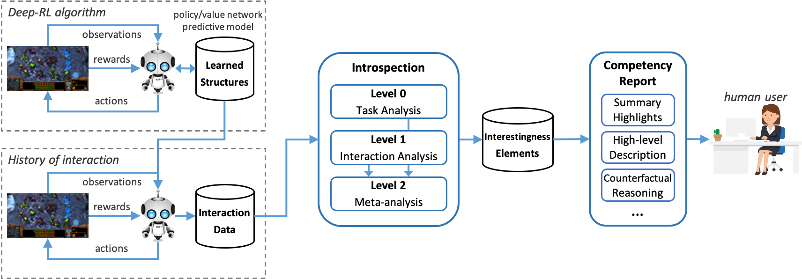
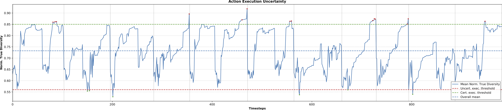
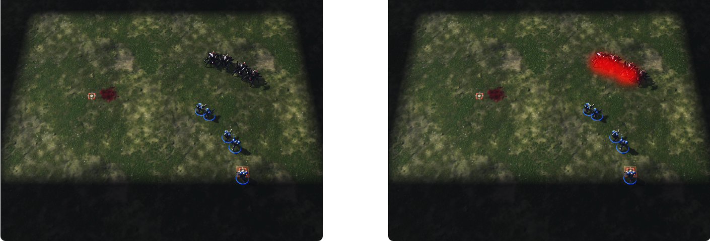

# Interestingness Elements

> `interestingness-xdrl`is an eXplainable Deep Reinforcement Learning (xdrl) framework based on the concept of Interestingness Elements

Currently, the module allows interaction data collection and interestingness elements extraction from deep-RL agents using the *reaver* toolkit running on *StarCraft II* (SC2) scenarios.

[TOC]

## Installation

```bash
git checkout https://gitlab.sri.com/caml/interestingness-xdrl.git
cd interestingness-xdrl
pip install -e .[caml]
```

### Dependencies

- `numpy` >= 1.13
- `jsonpickle`
- `matplotlib`
- `absl-py` >= 0.2.2
- `pillow`
- `gin-config` >= 0.1.1, <= 0.1.4
- `tensorflow-probability` >= 0.4.0, <= 0.6.0
- `tensorflow[-gpu]` == 1.13.2
- `opencv-python`
- `scikit-video` (requires installation of FFmpeg following the instructions in https://ffmpeg.org/download.html)
- `pyobjc-framework-Quartz` (optional, to record video highlights)
- `feature-extractor`
  - SRI repo: https://gitlab.sri.com/caml/interestingness-xdrl
- `reaver` (optional, to collect data from reaver policies)
  - SRI customized repo: https://gitlab.sarnoff.com/jesse.hostetler/reaver.git, branch `caml`
- `pysc2` (optional, to collect data from StarCraft II environments
  - SRI customized repo: https://gitlab.sarnoff.com/jesse.hostetler/pysc2.git, branch `pysc2v3`

### Notes

- Analysis of SC2 replays requires the installation of the SC2 game engine by following the instructions at: https://github.com/deepmind/pysc2#get-starcraft-ii
- Currently, highlights and counterfactuals extraction are only supported in mac OS.
- Further, to record the SC2 screen on Mac OS, recording by the executing app (e.g., `Terminal.app`) must be enabled in the settings by following "Settings" > "Security & Privacy" > "Privacy" > "Screen Recording" and then selecting the app.

## Overview

The following figure provides an overview of the framework:



## Learned Structures

The framework relies on **Learned Structures** acquired by training an RL agent model using any arbitrary deep-RL algorithm. These include things like a policy / value model learned by typical actor-critic approaches, and/or a predictive structure modeling the world dynamics / transition function.

Currently, the framework can perform analysis over RL policies learned with the reaver toolkit, which uses an advantage actor-critic (A2C) architecture whose learned model receives an observation input and the output provides a value function $V(s)$ and a probability distribution $\pi(s)$ over the task's action space.

## Interaction Data Collection

Given such learned structures we can then collect **Interaction Data** summarizing an agent's history of interaction with an environment. Currently, this consists in running the agent in an environment for several episodes and collecting the following data *at each* simulation timestep (see `interestingness_xdrl.InteractionDataPoint`):

- `observation`: the agent's observation containing different observation features
- `action`: the action to execute given the current observation (for the different action factors)
- `reward`: the reward associated with the observation, received from the environment
- `value`: the value associated with the observation
- `action_values`: the value(s) associated with each action factor given the observation
- `action_probs`: the probability distributions associated with each action factor given the observation
- `action_factors`: the action factors' labels, if the action is composed of different factors
- `new_episode`: whether this datapoint marks the beginning of a new episode

### Usage

The data-collection scripts are located under: `interestingness_xdrl/bin/collect`

In particular, the following command allows collecting interaction data from policies learned using the *reaver* RL toolkit.

```bash
python -m interestingness_xdrl.bin.collect.sc2_reaver
    --replay_sc2_version {latest, 4.10}
    --replay-file {path-to-replay-file}
    --results_dir {path-to-reaver-model-root}
    --experiment {path-to-reaver-model-from-root}
    --obs_features {"minimal","vae","vae2","screen"}
    --action_set {"minimal","screen"}
    --obs_spatial_dim {spatial-features-dims}
    --action_spatial_dim {spatial-actions-dims}
    --env {name-of-environment}
    --output {output-directory}
    [--gpu]
    [--verbosity {0, 1, ...}]
    [--clear]
```

The result of the data-collection procedure is an *interaction dataset*, a file named `interaction_data.pkl.gz` located in the `output` directory, containing the above data for each timestep of interaction. This dataset provides a compact representation of the agent’s *history of interaction* with the environment.

## Introspection and Interestingness Elements

After having collected the interaction data, we perform *introspection analysis* of interestingness. In particular, we examine the agent’s history of interaction with the environment to extract interestingness elements denoting meaningful situations that help characterize its competency in the task. 
Each element is generated by applying statistical analysis and machine learning methods to the collected interaction data. Currently, data is analyzed at three different levels, with each level proposing a set of different *dimensions of analyses*:

- **Level 0 – Task Analyses:** analyzes the characteristics of the task by characterizing how the environment is perceived by the agent. Because often times the agent has limited perception over the environment, analyses at this level try to characterize the task *in the agent’s perspective* rather that asserting how accurate the models are. 

- **Level 1 – Interaction Analyses:** the purpose of this level is to extract important aspects of the agent’s behavior and history of interaction with the environment. The dimensions of analysis at this level focus on the behavioral data structures learned by the RL algorithm during training that are relevant to decision-making, in particular, the learned policy, value functions, etc.

- **Level 2 – Meta-Analyses:** refers to analyses combining information gathered at the previous levels. The goal is to perform more complex analyses allowing the characterization of the agent’s *competency* in the task. This may involve combining information about the agent’s observed behavior and alternative, unobserved behavior. 

The different introspection analyses are located under `interestingness_xdrl/analysis`.

### Level 0: Task Analysis

#### Reward

Identifies uncommon situations regarding the reward received by the agent during its interaction with the environment. Reward outliers correspond to situations in which, on average within an episode, the agent received significantly more or less reward.  

**Extracted elements:**

- `all_rewards`: timestep-indexed received reward

- `low_rewards`: timesteps where rewards are significantly higher than average

- `high_rewards`: timesteps where rewards are significantly lower than average

- `mean_reward`: mean overall reward across all timesteps

**Use cases:** identify situations in which the agent is likely to receive relatively low or high rewards, denoting important moments as ascribed by the world/agent designer, i.e., independently of the learned behavior.

**Class:** `interestingness_xdrl.analysis.task.reward.RewardAnalysis`

### Level 1: Interaction Analysis

#### Execution Certainty

Characterizes how certain an agent is with regards to *action-selection* in each given situation, where certainty is given by the *mean normalized true diversity* (evenness) of the distributions over actions.

**Extracted elements:**

- `all_execution_divs`: timestep-indexed execution diversity for all actions

- `mean_execution_divs`: timestep-indexed mean execution diversity

- `mean_action_factor_divs`: mean execution diversity for each action factor

- `mean_execution_div`: mean overall execution diversity across all timesteps

- `uncertain_executions`: timesteps where execution diversity is above a threshold

- `certain_executions`: timesteps where execution diversity is below a threshold

**Use cases:** denote situations in which the agent is (un)certain of what to do and provide good opportunities to request guidance by a human user or identify tasks where agent would require more training.

**Class:** `interestingness_xdrl.analysis.interaction.execution_certainty.ExecutionCertaintyAnalysis`

#### Value

Uses the agent’s learned $V(s)$ function. It can be used to identify situations that are the most/least valuable for the agent. 

**Extracted elements:**

- `all_values`: timestep-indexed received value

- `low_values`: timesteps where values are significantly higher than average

- `high_values`: timesteps where values are significantly lower than average

- `mean_value`: mean overall value across all timesteps

**Use cases:** identify states to which the agent attributes relatively low or high value, denoting important moments as ascribed by the agent’s learned behavior.

**Class:** `interestingness_xdrl.analysis.interaction.value.ValueAnalysis`

#### Execution-Value

Represents an analysis of an agent's action-value function. It extracts information on the states where the *maximum absolute difference* between the values of any two actions (*i.e.*, action-value peak-to-peak) is significantly more or less valued than others (outliers). 

**Extracted elements:**

- `all_action_diffs`: timestep-indexed mean action-value differences (max-min)

- `low_action_diffs`: timesteps where value diffs are much higher than average

- `high_action_diffs`: timesteps where value diffs are much lower than average

- `mean_diff`: mean overall action-value difference across all timesteps

**Use cases:** denote *risky* situations, where taking one action is believed to lead to high cumulative rewards, while performing the min. action will lead to low future rewards on average.

**Class:** `interestingness_xdrl.analysis.interaction.execution_value.ExecutionValueAnalysis`

### Level 2: Meta-Analysis

Currently there are no implemented analyses at this level.

### Usage

The following command performs several analyses to extract interestingness elements according to previously-collected *interaction data*.

```bash
python -m interestingness_xdrl.bin.collect.analyze
    --data {path-to-pkl-gz-data-file}
    --config {path-to-config-file}
    --output {output-directory}
    [--img_format {output-images-format}]
    [--verbosity {0, 1, ...}]
    [--clear]
```

The result of the introspection phase is a set of interestingness elements. The results are saved to the `output` directory and are organized according to the different levels of analysis, and then by dimension. The generated fles contain the specific timesteps in which the agent exhibited an interesting behavior/decision, the values of the interestingness dimension for each timestep and episode, and plots to help visualize the data (see details below). 

## Competency Report

The introspection framework is the basis of competency reporting. We are mainly interested in directing users towards *intervention*. Specifically, we want users to understand *(sub)task competency*, *i.e.*, in which parts of the problem the agent is more or less competent. The goal is to allow users of understanding what needs to be adjusted in the agent for it to perform according to the designer's intent. We also want to identify situations requiring more training and provide opportunities for operators of the system to provide direct guidance. This can help operators decide when to delegate control to the agent.

We envision the design of an interactive user interface where different dimensions of analysis can be selected and information about the corresponding interestingness elements visualized. To support that vision, currently the framework provides the following types of competency report elements (source files located under `interestingness_xdrl/bin/report`):

### Plots

We automatically generate plots showing relevant data according to each dimension of analysis as a result of running the `analyze.py` script described above. For example, given data collected by the execution uncertainty dimension, we plot the evolution of the mean diversity of actions from which we extract (un)certain action execution situations, producing plots like the following: 



Additionally, having selected one particular element, we plot a comparison of the dimension of analysis for each action factor, producing a plot like the following:


### Highlights

These correspond to short video-clips capturing the behavior of the agent during key moments of interaction as dictated by the identified interestingness elements. The system is given a *budget* defined in terms of the maximum number of highlights per summary. The moments to be captured are then selected so as to maximize the *relevance* of the corresponding element (how high vs. low the dimension of analysis for that moment is), and the *diversity* of the moments within the task (*e.g.*, how different the observations are). 

#### Usage

Currently, the framework collects highlights for StarCraft II scenarios. The following command performs highlight extraction according to previously-collected *interaction data* and *analysis data*.

**Note:** currently highlight extraction only works on Mac OS.

```bash
python -m interestingness_xdrl.bin.report.highlights
    --replay_sc2_version {latest, 4.10}
    --replay-file {path-to-replay-file}
    --data {path-to-pkl-gz-interaction-data-file}
    --analysis {path-to-pkl-gz-analysis-file}
    --record_time_steps {num-timesteps-per-video}
    --max_highlights_per_elem {max-num-highlights-per-element}
    --fps {videos-frames-per-second}
    --fade_ratio {ratio-of-frames-faded}
    --output {output-directory}
    [--hide_hud]
    [--window_size {width,height}]
    [--verbosity {0, 1, ...}]
    [--clear]
```

The results are saved in the `output` directory and are organized according to the different levels of analysis, and then by dimension. For each selected moment from the interestingness analysis, a certain number of timesteps showing the state of the game (environment and units) is recorded before and after that timestep. Videos are saved in the `.mp4` format. A screenshot of the agent's observation at the interesting moment is also captured and saved in a `.png` format. Below is an example of a highlight captured for the SC2 *DefeatRoaches* minigame:


### High-Level Description

This uses CARLI's *high-level feature extractor* module to provide a textual description accompanying each selected element. In particular, we match the high-level features identified by the feature-extractor at the moment in which the element was captured. 

Given the possibly large number of features extracted, we present only the ones that seem to characterize a particular moment. For example, many features do not change value during episodes or long periods of time. To achieve that, we use the following selection criteria when choosing features: *local features*, selecting only features that changed prior and close to the occurrence of the element (determined by a certain number of timesteps); *common features*, selecting features that may not have changed close to the occurrence of the element but whose value is the same for *all* moments in which elements of the same type was detected.

#### Usage

The following command performs high-level feature extraction according to previously-collected *feature data* and *analysis data*.

```bash
python -m interestingness_xdrl.bin.report.features
    --features {path-to-features-csv-file}
    --analysis {path-to-pkl-gz-analysis-file}
    --time_steps {num-timesteps-prior-to-element}
    [--output {output-directory}]
    [--verbosity {0, 1, ...}]
    [--clear]
```

The results are saved in the `output` directory and are organized according to the different levels of analysis, and then by dimension. `{elem-name}-{t}.txt` files contain the high-level features and corresponding values for elemen `elem-name` at timestep `t`, while the `{elem-name}-common.txt` files contain the common features for all elements of that type.

### Counterfactual Reasoning

This competency reporting mechanism tries to answer questions of the form: *"under differing conditions → the task would be different from the agent's perspective"*. We are interested in measuring the impact that changing the agent’s observation input has in its competency via interestingness analysis. To achieve that, we first select moments of the agent’s interaction with the environment that are considered relevant according to interestingness analyses (the interestingness elements). Then, we discover perturbations to the agent’s observation that have the potential of changing the qualitative nature of the elements. The goal is to help a human operator to understand how the agent’s behavior would change given perturbations in the world; and, the reverse, *i.e.*, what needs to be modified in the environment to cause the agent to exhibit a different behavior.

**Perturbation methods:**

- **Manual removal:** currently, we use an observation perturbation method that iteratively removes of units by varying side, type, and amount. This is done by modifying the corresponding SC2 feature layers given the observation to be analyzed.
- **Imagination-based perturbation:** in the future, we will explore CARLI’s imagination component that will modify an observation given a set of perturbation factors.

After perturbing an observation, we re-perform interestingness analysis and measure the quantitative and qualitative difference to the original situation: *observation similarity*, *i.e.*, how similar the original and perturbed observations are; *interestingness difference*, *i.e.*, difference in the interestingness analysis dimension.

#### Usage

Currently, the framework performs manual perturbations for StarCraft II observations. The following command performs counterfactual extraction according to previously-collected *interaction data* and *analysis data*.

**Note:** currently counterfactual reasoning reporting only works on Mac OS.

```bash
python -m interestingness_xdrl.bin.report.highlights
    --replay_sc2_version {latest, 4.10}
    --replay-file {path-to-replay-file}
    --data {path-to-pkl-gz-interaction-data-file}
    --analysis {path-to-pkl-gz-analysis-file}
    --results_dir {path-to-reaver-model-root}
    --experiment {path-to-reaver-model-from-root}
    --obs_features {"minimal","vae","vae2","screen"}
    --action_set {"minimal","screen"}
    --obs_spatial_dim {spatial-features-dims}
    --action_spatial_dim {spatial-actions-dims}
    --env {name-of-environment}
    --output {output-directory}
    [--gpu]
    [--hide_hud]
    [--window_size {width,height}]
    [--verbosity {0, 1, ...}]
    [--clear]
```

The results are saved in the `output` directory and are organized according to the different levels of analysis, and then by dimension. Visual explanations are created for each counterfactual example by marking with a red color the changes to the original image, producing images similar to the following:



where the left image corresponds to the original observation at the moment identified by the interestingness introspection, and the right is a manually-perturbed version of that observation where 3 enemies were removed. This allows answering the counterfactual reasoning: *"what if the agent had to face only one enemy unit instead?"* In addition, a `counterfactuals.csv` file is created containing the information of all collected counterfactuals for each dimension of analysis, including the timestep where the counterfactuals were captured, the interestingness element, the perceptual distance and analysis dimension different between original and counterfactual observation, and a description of what was manually modified in the counterfactual.